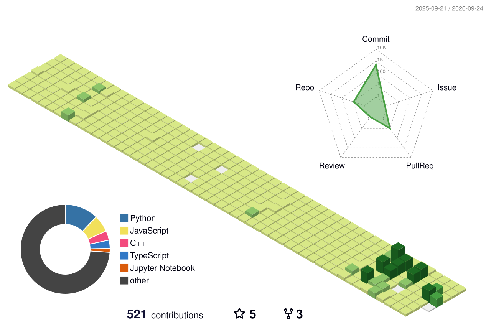

# Sangwoo Jin 

## School
- Sogang University
- Major in Mathematics and Computer Science 📝💻   

## Portfolio
Notion Link : [Click here](https://suave-phalange-86d.notion.site/6e962c83eaaa467aae6c6d15af0931c9)

## Problem Solving

### solved.ac

 &nbsp;&nbsp;

<!-- ## Github -->
<!-- 
  -->
## Participate 
- 2019.03 - 2019.08 코알라 유니브 1기   
- 2020.12 - 2021.02 ICPC Sinchon Algorithm Camp 2021 Winter  
- 2021.01 - 2021.06 GLFP Project (Front-End)  
- 2021.07 - 2021.08 ICPC Sinchon Algorithm Camp 2021 Summer  
- 2022.01 - 2022.02 2022 삼성 SDS 동계 알고리즘 특강 (C++) 
- 2022.01 - 2022.06 네이버 AI Tech 부스트캠프 (추천시스템)
- 2023.03 - 2023.08 Apple Developer Academy @POSTECH (iOS Developer)

## Awards 🏆
- 🥈 2021.08  SUAPC 2021 Summer (2021 신촌지역 대학생 프로그래밍 대회 동아리 연합 여름 대회) (2위 / 56팀, 현대오토Forever상)
- 🥇 2022.02  SUAPC 2022 Winter (2022 신촌지역 대학생 프로그래밍 대회 동아리 연합 겨울 대회) (1위 / 63팀, 현대 auto e;var sang;)

    
## Tech Stack 🛠️ 
</a> 
</a>
</a>
</a>
</a> 
</a>
</a> 

[Github 3D]

